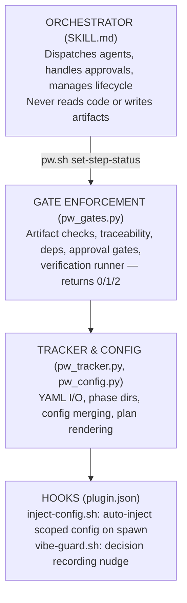
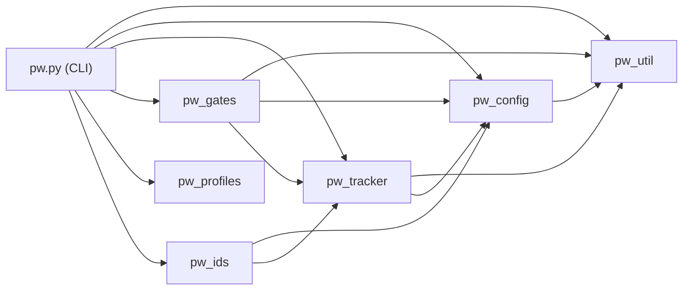
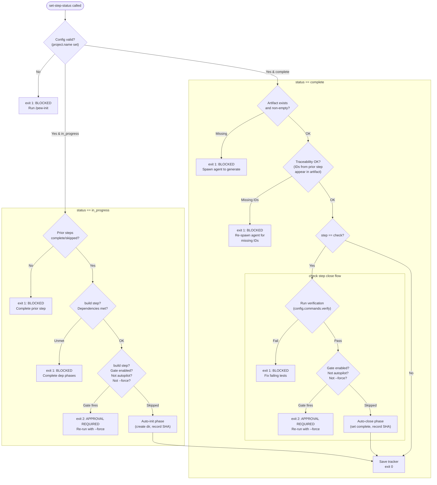

# PEW Build — Architecture & Flow Reference

## Overview

PEW Build is a YAML-based delivery orchestration system. An LLM orchestrator (SKILL.md) dispatches specialized agents through a 7-step phase workflow. A Python script (`pw.py`) enforces all quality gates programmatically — agents cannot bypass them.

**Core loop**: IDEAS → BRD → RESEARCH → SPEC → PLAN → BUILD → CHECK/CLOSE

**Source of truth**: `phases/phase-tracker.yaml`

---

## System Layers



---

## Module Map

```
plugin/scripts/lib/
  pw.py              CLI entry point, thin cmd_ wrappers, re-exports all modules
  pw_util.py         Constants (STEP_ORDER, VALID_*, SIZE_SKIP_STEPS, etc.), kebab_case, _norm_num
  pw_config.py       Config load/merge/validate/dump, DEFAULT_CONFIG, CONFIG_SCOPES
  pw_tracker.py      Tracker load/save, find_phase, phase_dir, render_plan
  pw_gates.py        run_verification, _verify_traceability, _check_dependencies, cmd_set_step_status
  pw_profiles.py     Review profile parsing, matching, inheritance resolution
  pw_ids.py          FC/AC/T ID extraction from BRD + SPEC
```

**Dependency DAG** (no cycles):



---

## Phase Tracker Schema

Each phase in the YAML tracker has these fields:

| Field | Type | Default | Purpose |
|---|---|---|---|
| `number` | int/float | *required* | Phase ID (7.5 allowed for insertion) |
| `title` | string | *required* | Converted to kebab-case for directory name |
| `brief` | string | "" | Short description |
| `brief_file` | string | "" | Path to external context doc (e.g., AUDIT-BRIEF.md) |
| `refs` | list[str] | [] | Reference doc paths for agents to resolve finding IDs |
| `status` | string | "not_started" | `not_started` → `started` → `complete` |
| `mode` | string | "manual" | `manual` / `auto` / `autopilot` |
| `size` | string | "large" | Controls which steps are skipped |
| `depends_on` | list[int/float] | [] | Phases that must complete before BUILD |
| `tags` | list[str] | [] | Controls which council experts activate (e.g., frontend, backend) |
| `start_commit` | str/null | null | Git SHA at phase init |
| `end_commit` | str/null | null | Git SHA at phase close |
| `verification_passed` | bool | absent | Set by pw.py after verify passes |
| `steps` | dict | auto | Step status map (see below) |

### Steps

Keys: `ideas`, `brd`, `research`, `spec`, `plan`, `build`, `check`

Values: `not_started` → `in_progress` → `complete`, or `skipped` (immutable, set at creation by size)

### Phase Sizing

| Size | Skipped | Remaining Steps | Use Case |
|---|---|---|---|
| **large** | none | all 7 | Major features |
| **medium** | ideas | BRD → CHECK | Well-understood features |
| **small** | ideas, research | BRD → CHECK | Bug fixes, small changes |
| **audit** | ideas, research | BRD → CHECK | Audit-derived (AUDIT-BRIEF.md) |
| **vibe** | ideas, brd, research, spec, plan | BUILD → CHECK | Build-first (/pew-vibe) |

---

## Gate Enforcement Chain

`pw.sh set-step-status --phase N --step S --status ST [--force]`

Every gate is enforced by `pw_gates.py`. The orchestrator cannot bypass them. Exit codes: **0** = success, **1** = hard failure (fix and retry), **2** = approval needed (re-run with `--force`).

### Gate sequence (in order)



### Output messages

Every gate failure prints:
- `BLOCKED:` prefix with what failed
- `Action:` line telling the LLM exactly what to do next

Approval gates print:
- `APPROVAL REQUIRED:` with context
- `Action: Present the ... gate to the user via AskUserQuestion. After user approves, re-run with --force.`

### Mode-aware step guidance

After every successful `set-step-status` call, pw.py prints contextual guidance so the orchestrator doesn't have to remember mode rules:

**On step start** (`in_progress`):

| Mode | Output |
|---|---|
| **autopilot** | `MODE: autopilot — open questions auto-resolved (use recommended option, do NOT call AskUserQuestion). Fix policy: P1 auto-fix, P2 auto-fix then defer, P3 auto-defer.` |
| **auto** | `MODE: auto — proceed to next step automatically after this one completes. Approval gates still require user confirmation.` |
| **manual** | No MODE line (default behavior) |

**On phase close** (`check → complete`):

| Situation | Output |
|---|---|
| Next auto/autopilot phase with deps met exists | `NEXT: Phase 5 Feature X is in autopilot mode — start it immediately.` |
| Current was auto/autopilot but no eligible phases left | `Autopilot complete — no more eligible phases in auto/autopilot mode.` |
| All phases complete | `All phases complete.` |
| Current was manual | No guidance (user drives next action) |

The NEXT directive checks dependency satisfaction — it won't recommend a phase whose dependencies aren't met, skipping to the first eligible one instead.

---

## Verification Runner

`run_verification()` in `pw_gates.py`:

- Runs `config.commands.verify` via subprocess
- Streams stdout+stderr with 1-second poll granularity
- Full output written to `{phase_dir}/verify-output.log`
- **Idle timeout**: 300s without output → kills process, exit 1
- **On success**: prints `"Verification passed ✓"`
- **On failure**: prints last 30 lines + log path + action line (not the full test output)
- **On `--force` re-run**: if `verification_passed == True`, skips re-run (avoids double test run after approval gate)

---

## Phase Modes

| Mode | Approval Gates | Open Questions | Fix Cycles | Multi-Phase |
|---|---|---|---|---|
| **manual** | Fire (exit 2) | AskUserQuestion | User decides | No |
| **auto** | Fire (exit 2) | Recommended if high confidence, else ask | User decides | No |
| **autopilot** | Skipped | Always use recommended option | P1 auto-fix (3 max), P2 auto-fix→defer, P3 auto-defer | Yes (loop) |

Set via: `pw.sh set-mode --phase N --mode autopilot`
Or at creation: `pw.sh add-phase --mode autopilot`

Stored in tracker YAML — pw.py reads it, agent can't forget it.

---

## Config (pew.yaml)

Loaded by `pw_config.load_config()`, deep-merged with defaults. Lists replace entirely (not appended).

```yaml
project:
  name: "My App"                    # REQUIRED — blocks workflow if default
  description: ""

paths:
  tracker: phases/phase-tracker.yaml
  plan: phases/implementation-plan.md
  phases: phases
  research: phases/research
  audit_test: phases/audit/test
  audit_ux: phases/audit/ux
  audit_react: phases/audit/react   # also exists in DEFAULT_CONFIG
  guidelines: ""                    # optional playbook directory

commands:
  verify: "npm test"                # full CI (lint, typecheck, unit, e2e)

stack:
  description: ""
  frontend_src: ""                  # activates council-frontend when set
  component_paths: []
  install_commands: {}

competitors: []
conventions_file: ""

council:
  enabled: true
  max_findings_per_expert: 15
  skip_tags: []
  experts: []

approval_gates:
  before_build: true                # skipped when mode=autopilot
  before_close: true                # skipped when mode=autopilot

product_review:
  enabled: true
  app_url: "http://localhost:5173"
  start_command: ""

review_profiles_dir: ""             # default: ${CLAUDE_PLUGIN_ROOT}/review-profiles/
```

### Config Scopes (for agent injection)

| Scope | Fields | Agent Types |
|---|---|---|
| `agent` | project, paths, stack, conventions_file | build-*-developer, build-*-writer |
| `council` | project, paths, council, conventions_file | council-* experts |
| `research` | project, paths, stack, competitors | build-feature-benchmarker, build-ux-* |

---

## Hook System

### SubagentStart Hook (`inject-config.sh`)

**Trigger**: Agent spawn matching `build-|council-`

**Flow**: Reads agent_type → maps to scope → runs `pw.sh dump-config --scope <scope>` → injects as `additionalContext`

**Result**: Agents see `config.*` fields in their context. No manual config passing needed in spawn prompts.

### PreToolUse Hook (`vibe-guard.sh`)

**Trigger**: Any Bash tool use during active vibe phase

**Flow**: Detects `git add`/`git commit` → nudges to record decisions in D-nnn format

---

## Orchestrator Step Dispatch (SKILL.md)

For each step, the orchestrator:
1. `pw.sh set-step-status --step S --status in_progress` (pw.py enforces gates)
2. Spawn agent(s) with phase context + file paths (never content)
3. Atomic commit
4. `pw.sh set-step-status --step S --status complete` (pw.py enforces artifact + traceability)

### Step 1: IDEAS
Agents: `build-feature-benchmarker` (market research), `build-ideas-writer`
Output: `IDEAS.md`

### Step 2: BRD
Agent: `build-brd-writer`
Output: `BRD.md` (FC-nnn, AC-nnn)

### Step 3: RESEARCH
Agents: `build-ux-researcher` + `build-ux-designer` (if frontend+large), `build-research-writer`
Output: `RESEARCH.md`, optionally `DESIGN.md`

### Step 4: SPEC
Agent: `build-spec-writer`
Output: `SPEC.md` (T-nnn)

### Step 5: PLAN
Agent: `build-plan-writer`
Output: `PLAN.md`

### Step 6: BUILD
Agents: `build-frontend-developer` / `build-backend-developer` (per task from PLAN)
pw.py gates: dependency check + BUILD approval

### Step 7: CHECK/CLOSE
**7a** — Council review: dispatch 4-6 expert agents in parallel, merge findings
**7b** — Alignment checker + product reviewer + code quality check
**7c** — Fix cycle: P1→P2→P3, max 3 cycles
**7d** — Close: pw.py gates: verification + CLOSE approval

---

## Traceability

| Source | IDs | Target | Gate |
|---|---|---|---|
| IDEAS.md | IDEA-nnn (selected only) | BRD.md | brd completion |
| BRD.md | FC-nnn | SPEC.md | spec completion |
| SPEC.md | T-nnn | PLAN.md | plan completion |

Enforced by `pw_gates._verify_traceability()` — auto-runs on step completion. Skipped if source step was `skipped` (e.g., small phases skip ideas→brd check).

---

## Autopilot Phase Loop

After closing a phase in autopilot mode:
1. `list-phases --json` → filter non-complete, non-skipped
2. `check-dependencies --phase N` for each candidate
3. First with satisfied deps → `analyze-phase --json` → begin at first incomplete step
4. Repeat until no eligible phases or `--limit` reached
5. Produce summary report

---

## Command Reference

```
pw.sh set-step-status --phase N --step S --status ST [--force]
pw.sh set-mode --phase N --mode manual|auto|autopilot
pw.sh set-mode --from N [--to M] --mode autopilot
pw.sh analyze-phase --phase N [--json]
pw.sh add-phase --number N --title T [--brief] [--brief-file] [--depends-on] [--tags] [--size] [--mode]
pw.sh list-phases [--status S] [--json]
pw.sh next-phase-number
pw.sh verify-traceability --phase N --from S --to S
pw.sh check-dependencies --phase N [--through S]
pw.sh phase-diff --phase N
pw.sh dump-config [--scope agent|council|research]
pw.sh resolve-profiles --profiles-dir DIR --files F [--summary] [--json]
pw.sh extract-ids --phase N
pw.sh validate-config
pw.sh generate-verify-commands
```

---

## Definition of Done

A phase is `complete` when:

1. All required artifacts exist and committed:
   - **large**: IDEAS.md, BRD.md, RESEARCH.md, SPEC.md, PLAN.md, COUNCIL-REVIEW.md
   - **medium**: BRD.md, RESEARCH.md, SPEC.md, PLAN.md, COUNCIL-REVIEW.md
   - **small/audit**: BRD.md, SPEC.md, PLAN.md, COUNCIL-REVIEW.md
   - **vibe**: BRD.md, SPEC.md, COUNCIL-REVIEW.md (synthesized post-hoc)
2. Traceability verified across non-skipped steps
3. All tests implemented or explicitly descoped
4. Verification passed (enforced by pw.py on close)
5. Documentation drift reconciled
6. Alignment check passed
7. No P1 issues open
8. Tracker status set to `complete`
